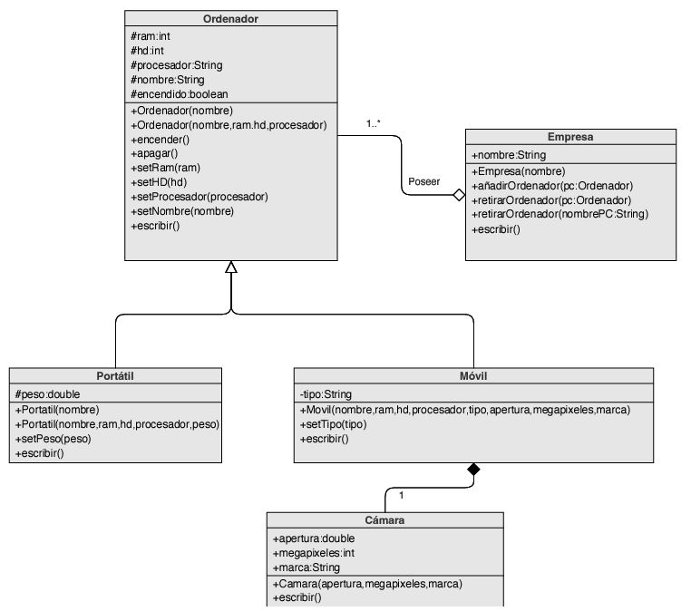

#### Ejercicio Github

## Programación Orientada a Objetos


1. Expectativas antes de aprender POO. 

Antes de aprender sobre la programación orientada a objetos, mi perspectiva estaba más orientada hacia un enfoque estructural. Concebía la programación como un conjunto de funciones organizadas, pero no había considerado la idea de organizar el código en objetos con propiedades y comportamientos específicos.
___
2. ¿Qué creías que ibas a aprender?

Al adentrarme en los conceptos iniciales de la programación orientada a objetos, descubrí que estaba adoptando un nuevo enfoque que se centra más en entender cómo se usan los programas en lugar de solo resolver problemas individuales. Este cambio me permitió ver el software como un conjunto de piezas interconectadas. En resumen, la POO me enseñó a pensar de manera más práctica y flexible en el desarrollo de programas."
___
3. ¿Para qué creías que iba a servir?

Antes de descubrir la programación orientada a objetos, 
no tenía una idea clara de cómo mejorar la eficiencia y la adaptabilidad de los 
programas. Sin embargo, ahora entiendo que la POO nos ayuda a crear soluciones 
que se ajustan mejor a cualquier tipo de dispositivo, pasando de codificar muchísimos
métodos y variables algo caóticas a agruparlos por usos dentro de clases.
Es como tener un conjunto de herramientas versátiles para 
hacer que nuestros programas funcionen en cualquier lugar.
___
4. ¿Qué has aprendido durante las dos unidades?

Durante el transcurso de estos dos últimos temas he llegado a aprender varios conceptos y técnicas que creo que son fundamentales a la hora de desarrollar programas. 

Las ideas principales son:
* Objetos y clases: Las clases son las plantillas que usamos para crear objetos, los objetos son instancias de esas clases.
* Constructores:
* Encapsulamiento: 
* Ocultación: Podemos elegir como queremos que se visualicen nuestras propiedades.
* Polimorfismo:
* Herencia:
* Abstracción:
___
5. Ejercicios más importantes de las prácticas 

Para mi las prácticas fundamentales con las que he llegado a entender mejor la programación a objetos son:
* la Práctica 21(carta/Dado): 
* Práctica 25(Herencia):


> Practica 25: Herencia

* ¿Por qué?
  Con estas prácticas llegue a entender como funciona la creación de clases y de objetos, creo que al ser tan simple ayuda a que se asimile mejor.

* ¿Cómo lo has resuelto?


  

<!-- -->

```
public void     (){
    
}
```
* Conclusiones sobre las dos unidades

__